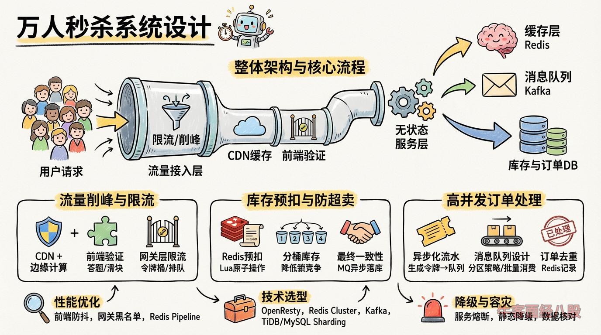

# 设计一个支持万人同时抢购商品的秒杀系统，如何解决超卖、库存扣减和高并发请求问题？
解题思路

### ****  
 

### **一、核心挑战分析**

1.  **超卖问题**：多线程并发扣减库存导致库存负数。
2.  **库存准确性**：分布式环境下如何保证扣减原子性。
3.  **高并发流量**：瞬时流量可达数十万QPS，需避免服务雪崩。
4.  **数据一致性**：订单、库存、支付状态的最终一致性保障。

---

### **二、整体架构设计**

|  |  |
| --- | --- |
| 1  2  3 | `用户请求 → 流量接入层（限流/削峰） → 无状态服务层 → 异步订单队列 → 库存与订单DB`                           `↓              ↓`                        `缓存层（Redis）  消息队列（Kafka）` |

---

### **三、核心模块解决方案**

#### **1. 流量削峰与限流**

*   **CDN + 边缘计算**：
    *   静态资源（商品图片、页面）提前缓存至CDN，减少回源请求。
*   **前端限流**：
    *   答题验证（数学题、滑块验证码）过滤机器人。
    *   客户端随机延迟+按钮置灰，避免用户高频点击。
*   **网关层限流**：
    *   **令牌桶算法**：Nginx+Lua实现动态限流（如1万QPS）。
    *   **排队系统**：请求进入队列，异步返回排队进度（如12306）。

#### **2. 库存预扣与防超卖**

*   **Redis预扣库存**：
    *   **原子操作**：通过DECR或Lua脚本实现原子扣减。  
         
        
        |  |  |
        | --- | --- |
        | 1  2  3  4  5  6 | `-- Lua脚本：扣减库存（保证原子性）`  `if` `redis.call('get', stock_key) >= '1'` `then`      `return` `redis.call('decr', stock_key)`  `else`      `return` `-1`  `end` |
*   **分桶库存**：
    *   将总库存拆分为多个桶（如100个），每个桶独立扣减，降低锁竞争。
    *   示例：1000件库存 → 10个桶，每个桶100件。
*   **最终一致性保障**：
    *   扣减Redis库存后，发送消息到MQ，由消费者异步落库。
    *   异常回滚：若数据库扣减失败，通过MQ反向补偿Redis库存。

#### **3. 高并发订单处理**

*   **异步化订单流水**：
    *   用户抢购成功→生成唯一令牌（Token）→跳转到下单页。
    *   下单页提交令牌，进入订单队列（Kafka），异步生成正式订单。
*   **消息队列设计**：
    *   **分区策略**：按用户ID哈希到不同分区，保证单个用户请求顺序性。
    *   **批量消费**：消费者批量处理订单（如100条/次），提升数据库写入效率。
*   **订单去重**：
    *   Redis Set记录已处理的用户令牌，防止重复提交。

#### **4. 缓存与数据库协同**

*   **多级缓存策略**：
    *   **本地缓存**（Caffeine）：缓存商品信息（库存除外），降低Redis压力。
    *   **Redis集群**：库存数据分片存储（Codis/Redis Cluster）。
*   **数据库优化**：
    *   **分库分表**：订单表按用户ID分片，库存表按商品ID分片。
    *   **合并写入**：库存扣减使用UPDATE stock SET count=count-1 WHERE id=xx AND count>0，配合乐观锁版本号。

#### **5. 降级与容灾**

*   **服务熔断**：
    *   监控数据库负载，超过阈值时熔断非核心服务（如积分抵扣）。
*   **静态降级**：
    *   超卖时返回预设售罄页面，跳过后端逻辑。
*   **数据核对**：
    *   定时任务对比Redis与数据库库存，自动修复不一致。

---

### **四、性能优化关键点**

| **模块** | **优化手段** | **效果** |
| --- | --- | --- |
| **前端** | 静态资源CDN化 + 按钮防抖 | 减少90%无效请求 |
| **网关** | Nginx限流 + IP黑名单 | 拦截50%恶意流量 |
| **库存扣减** | Redis分桶 + Lua原子操作 | 支撑10万QPS扣减 |
| **订单处理** | Kafka批量消费 + 数据库批量插入 | 订单写入速度提升5倍 |
| **缓存** | 本地缓存 + Redis Pipeline | Redis QPS提升3倍 |

---

### **五、技术选型案例**

*   **流量接入层**：OpenResty（Nginx+Lua）
*   **缓存层**：Redis Cluster + Redisson（分布式锁）
*   **消息队列**：Kafka（高吞吐） / Pulsar（低延迟）
*   **数据库**：TiDB（分布式事务） / MySQL分库分表 + ShardingSphere
*   **监控**：Prometheus + Grafana（实时监控） + ELK（日志分析）

---

### **六、容灾与数据恢复**

1.  **库存超卖应急**：
    *   事前预案：设置安全库存（如预留1%库存应对数据不一致）。
    *   事后修复：超卖订单人工审核补偿（退款或补货）。
2.  **Redis宕机处理**：
    *   降级到数据库扣减，启用限流保护。
3.  **MQ消息堆积**：
    *   动态扩容消费者，或降级为同步写库（牺牲性能保可用性）。

---

### **总结**

通过 **流量分层过滤** + **Redis原子扣减** + **异步订单流水** 的核心设计，结合 **分桶策略** 和 **多级缓存**，可构建支撑万人并发的秒杀系统。关键是通过「空间换时间」将同步操作异步化，通过「预扣库存」和「最终一致性」平衡性能与准确性。实际落地需配合全链路压测（如JMeter模拟峰值流量），持续优化各环节瓶颈。