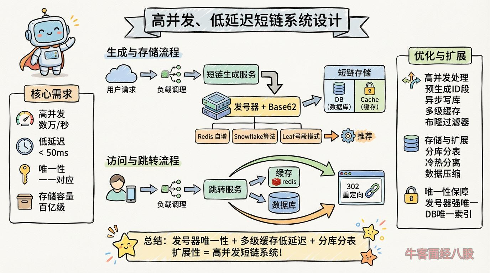

# 如何设计一个高并发、低延迟的短链生成与跳转服务？如何保证短链唯一性和高并发？
解题思路

### ****  
 

### **一、核心需求分析**

1.  **高并发**：支持每秒数万级请求（如活动推广场景）。
2.  **低延迟**：短链跳转平均响应时间 < 50ms。
3.  **唯一性**：确保短链与原始 URL 一一对应，避免重复。
4.  **存储容量**：支持百亿级短链存储，且具备水平扩展能力。

---

### **二、系统架构设计**

#### **1. 整体架构**

|  |  |
| --- | --- |
| 1  2  3 | `用户请求 → 负载均衡 → 短链生成服务 → 发号器 → 短链存储（DB + Cache）`               `↓`  `用户访问 → 短链跳转服务 → 缓存 → 数据库 → 302重定向` |

#### **2. 核心组件**

*   **短链生成服务**：接收长链，生成唯一短链。
*   **发号器**（ID Generator）：生成全局唯一 ID，作为短链的种子。
*   **短链存储**：分布式数据库（如 TiDB） + 缓存（如 Redis）。
*   **跳转服务**：解析短链，返回 302 重定向。

---

### **三、关键问题解决方案**

#### **1. 短链生成算法**

| **方案** | **实现方式** | **优缺点** |
| --- | --- | --- |
| **哈希算法** | MD5/SHA1 取前 N 位 → Base62 编码 | ✅ 无中心化依赖   ❌ 需处理哈希冲突 |
| **发号器 + Base62** | 分布式发号器生成唯一 ID → Base62 编码 | ✅ 绝对唯一   ✅ 短链长度固定（如 6-8 字符）   ❌ 依赖发号器高可用 |

##### **推荐方案：发号器 + Base62**

*   **发号器实现**：
    
    *   **Redis 自增**：INCR命令生成连续 ID（需集群部署）。
    *   **Snowflake 算法**：时间戳 + 机器 ID + 序列号（无需中心化服务）。
    *   **Leaf 号段模式**：批量预分配 ID 段（如每次取 1000 个 ID）。
*   **Base62 编码**：将 ID 转换为\[0-9a-zA-Z\]字符串（62 进制）。
    
    |  |  |
    | --- | --- |
    | 1  2  3  4  5  6  7 | `def base62_encode(num):`      `chars = "0123456789abcdefghijklmnopqrstuvwxyzABCDEFGHIJKLMNOPQRSTUVWXYZ"`      `result = []`      `while` `num > 0:`          `num, rem = divmod(num, 62)`          `result.append(chars[rem])`      `return` `''.join(reversed(result))` |

#### **2. 高并发处理**

*   **发号器优化**：
    
    *   **预生成 ID 段**：服务启动时预加载一批 ID 到内存（如 Leaf 号段模式）。
    *   **异步写库**：生成短链后异步写入数据库，避免阻塞请求。
*   **跳转服务优化**：
    
    *   **多级缓存**：Redis（热数据） → 本地缓存（Caffeine，防缓存击穿）。
    *   **布隆过滤器**：快速过滤无效短链请求（如 RedisBloom）。

#### **3. 存储与扩展**

*   **数据库设计**：
    
    |  |  |
    | --- | --- |
    | 1  2  3  4  5  6  7 | `CREATE` `TABLE` `short_url (`      `id BIGINT` `PRIMARY` `KEY,         -- 发号器生成的唯一 ID`      `short_key VARCHAR(8) NOT` `NULL, -- Base62 编码后的短链（如 "a3d9Kj"）`      `original_url TEXT NOT` `NULL,    -- 原始长链接`      `expire_time DATETIME,          -- 过期时间（可选）`      `UNIQUE` `INDEX` `(short_key)`  `);` |
*   **分库分表策略**：
    
    *   **按短链前缀分片**：如短链前 2 位作为分片键（支持 62^2=3844 个分片）。
    *   **一致性哈希**：动态扩缩容时数据迁移量最小。

#### **4. 唯一性保障**

*   **发号器强唯一性**：通过 Snowflake 机器 ID 或数据库自增主键保证。
*   **数据库唯一索引**：short\_key字段添加唯一约束，防止并发冲突。

#### **5. 存储容量优化**

*   **冷热数据分离**：
    *   **热数据**：近期生成的短链存入 Redis（设置 TTL）。
    *   **冷数据**：过期或低频数据归档到对象存储（如 S3）。
*   **数据压缩**：原始 URL 使用 GZIP 压缩存储（节省 50%-70% 空间）。

---

### **四、技术选型**

| **组件** | **推荐方案** | **替代方案** |
| --- | --- | --- |
| 发号器 | Leaf 号段模式 | Redis 自增/Snowflake |
| 缓存 | Redis Cluster | Memcached |
| 数据库 | TiDB（分布式 MySQL） | 分库分表 MySQL + MyCat |
| 跳转服务 | Nginx + OpenResty | Spring Cloud Gateway |

---

### **五、总结**

通过 **发号器唯一性保障** + **多级缓存低延迟** + **分库分表扩展性** 的核心设计，结合异步处理、冷热分离等优化手段，可构建一个支撑高并发、低延迟的短链系统。实际部署时需根据业务规模选择组件（如中小系统可用 Redis 自增简化设计），并持续监控调整分片策略与缓存容量。